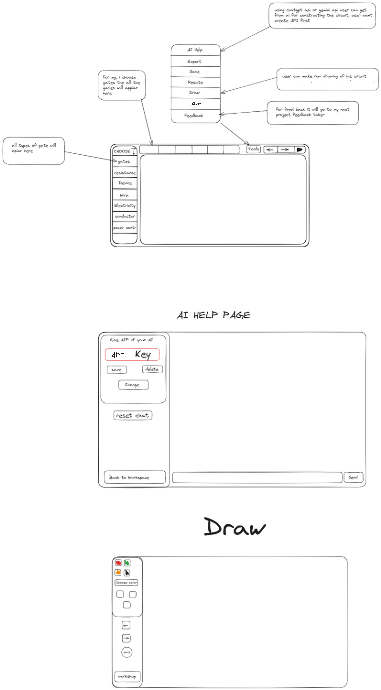

# Coding Website Project

This project is a web-based application designed to facilitate circuit design and coding with the help of AI integration. Users can construct circuits, draw diagrams, and get AI assistance for various tasks. The interface is designed to be user-friendly and intuitive, making it easy for users to navigate and utilize the features.

## Features

- **Component Selection**: Choose from different types of components like gates, resistance, devices, wires, electricity, conductors, and power controls.
- **AI Help**: Get assistance for constructing circuits using AI. The AI help is powered by external APIs such as OpenAI or Gemini.
- **Drawing Tool**: Make raw drawings of circuits with a functionality similar to Excalidraw.
- **Project Management**: Save, export, reset, and share your projects easily.
- **Feedback**: Send feedback directly through the interface.

## Interface Overview

### Main Interface



1. **Toolbox (Left Sidebar)**
   - **Choose Component**: Select different types of components.
   - **Component Options**: All types of the selected component will appear here for easy selection.

2. **Top Menu**
   - **AI Help**: Opens the AI help page for assistance.
   - **Export**: Export your project.
   - **Save**: Save your progress.
   - **Reset**: Reset the workspace to the initial state.
   - **Draw**: Access the drawing tool.
   - **Share**: Share your project with others.
   - **Feedback**: Send feedback about the project.

### AI Help Page

- **API Key Management**: Enter and manage your API key for AI services.
- **Reset Chat**: Reset the AI chat interface.
- **Back to Workspace**: Return to the main workspace.

### Drawing Tool

- **Color Selection**: Choose different colors for drawing.
- **Basic Tools**: Basic drawing tools for creating circuit diagrams.
- **Save**: Save your drawing.
- **Workspace Navigation**: Return to the main workspace.

## Getting Started

### Prerequisites

- Web browser (latest version)
- Internet connection

### Installation

1. Clone the repository:
   ```sh
   git clone https://github.com/PATILYASHH/electronics-circuit-simulator.git

join Discord - [Join](https://discord.gg/jyGZj5qq) 


